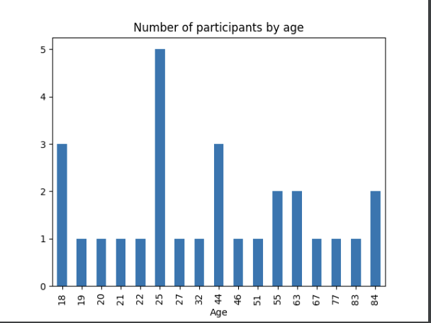

# Playground: Python

This is a playground for stuff based on the
[Python](https://www.python.org) programming language and ecosystem.

## Digging and plotting data with Pandas + Matplotlib

See:

- [Pandas](https://pandas.pydata.org)
- [Matplotlib](https://matplotlib.org)

### CSV with `./stats_pandas.py`

This script reads file `data.csv` and extracts some
simple metrics out of it and plots some of them.

#### Example output

```shell
Participants (sorted by age, then height):
====================================
      Id Gender  Age  Height  Weight
10  1710      D   18     159      80
16  1716      F   18     166      55
17  1717      F   18     184      57
5   1705      F   19     171      69
..   ...    ...  ...     ...     ...
8   1708      D   77     188      90
9   1709      F   83     152      59
24  1724      M   84     172      73
23  1723      F   84     181      85

[28 rows x 5 columns]


Averages (rounded):
====================================
Average age:	42.1 yrs
Average height:	174.29 cm
Average weight:	78.82 KG
```

#### Example plot

